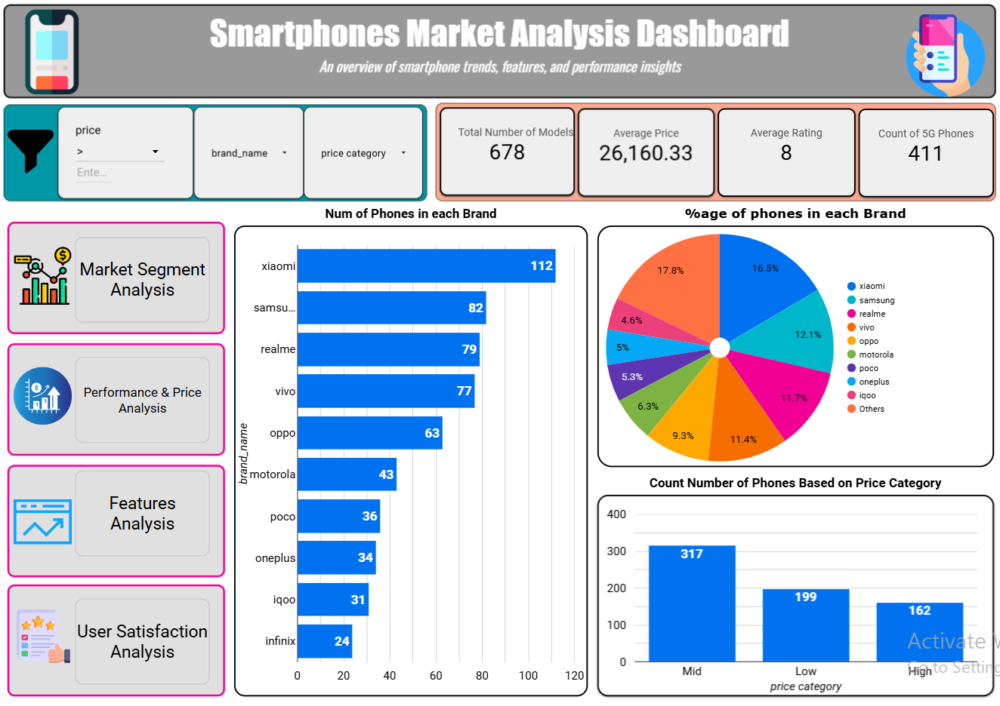

# Smartphones-Market-Analysis-Dashboard
This contain a Looker Studio  Dashboard of Smartphones Market Analysis.

# 📱 Smartphone Market Analysis Dashboard  📊 [Click and go to Dashboard](https://lookerstudio.google.com/reporting/bf2b3d25-d10c-4e8c-9579-f1e7b13a872b)

An interactive and visually rich **Business Intelligence Dashboard** built with **Looker Studio**, this project provides a comprehensive analysis of the smartphone market—highlighting key trends, performance metrics, feature comparisons, and user satisfaction insights.

This dashboard is designed for **product managers, business analysts, marketers, and decision-makers** seeking to understand smartphone trends and identify strategic opportunities based on real-world data.

---

## 🎯 Project Objective

The goal of this dashboard is to turn raw smartphone data into actionable insights through a clean, intuitive, and fully interactive experience. With multi-page navigation, dynamic filters, and insightful visuals, users can explore:

- Market trends
- Feature-performance correlations
- Customer satisfaction drivers
- Price segmentation
- 5G adoption and more

---

## 🧭 Dashboard Navigation Structure

The dashboard is organized into four core sections, each designed to deliver targeted insights for strategic decision-making in the smartphone market.

---

### 🔍 **1. Market Segment Analysis**

This section provides a breakdown of the smartphone market by brand, price range, and 5G adoption. It highlights how different brands perform across various price segments and how modern technologies like 5G are being adopted across devices.

> 📷 *Preview:*

---

### ⚙️ **2. Performance & Price Analysis**

This section focuses on how smartphone pricing relates to technical performance. It helps uncover trends such as whether higher prices correspond with better processors, battery capacity, or overall user satisfaction.

> 📷 *Preview:*

---

### 📸 **3. Feature Analysis (Camera, Battery, Memory)**

This section offers an in-depth view of how specific features—like camera megapixels, RAM, and battery life—impact user ratings. It's a valuable resource for understanding which features users care about most when evaluating a smartphone.

> 📷 *Preview:*

---

### 😊 **4. User Satisfaction Analysis**

This section dives into the factors that influence user satisfaction, including operating systems, screen specifications, and overall design. It also includes a correlation analysis to reveal which features have the greatest impact on customer ratings.

> 📷 *Preview:*

---

